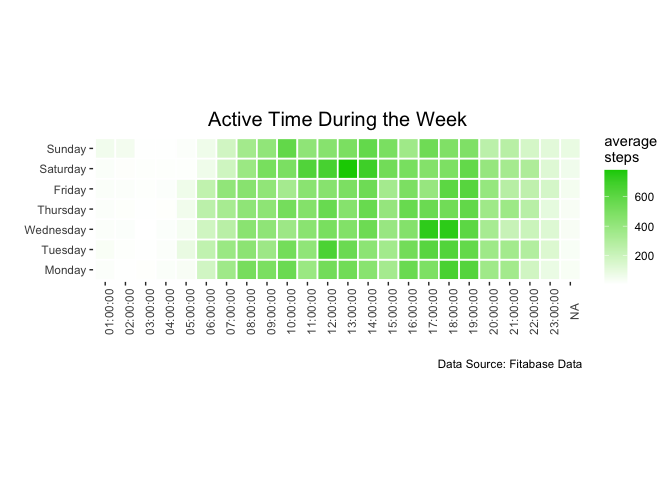
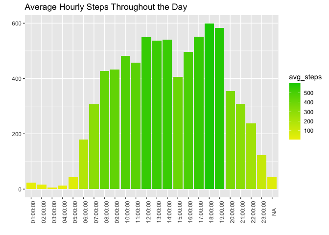

Fitness Tracker Data Exploration Using RStudio
================
By Supoj Xu (Sean)  


## Project Overview

This exploratory analysis is a capstone project for *Google Data
Analytics Professional Course*. I selected this topic because of
my personal interest in healthy lifestyle and health data. In this project, I use *RStudio* for the
entire exploration and *R Markdown* for reporting the process and the
results.

The dataset I will be analyzing is called `Fitbit fitness tracker data`
from a publicly accessible source. There are 18 CSV files which contain
fitness data of users assigned with unique IDs. Because many files
contain overlapping data, I chose 4 files that cover most of the data to
work on.

The main **objective** is to analyze smart device fitness data in order
to identify trends and insights regarding customer’s health, behavior and
smart device usage.

For readability, I have divided this project into **4 phases** as
follow:

- **Phase 1:** Understanding data.

- **Phase 2:** Cleaning data.

- **Phase 3:** Analyzing and visualizing data.

- **Phase 4:** Sharing insights from the analysis

&nbsp;

Let’s get started!

&nbsp;

## Phase 1: Understanding data

### 1.1 Loading packages used in this analysis

I will import **janitor** and **tidyverse** libraries which comprise of
packages such as `dplyr`, `readr`, `tidyr`, `ggplot2`, and `lubridate` for
reading files, cleaning data, conducting analysis, plotting graphs, etc.

``` r
library(tidyverse)
```

    ## ── Attaching core tidyverse packages ──────────────────────── tidyverse 2.0.0 ──
    ## ✔ dplyr     1.1.2     ✔ readr     2.1.4
    ## ✔ forcats   1.0.0     ✔ stringr   1.5.0
    ## ✔ ggplot2   3.4.3     ✔ tibble    3.2.1
    ## ✔ lubridate 1.9.2     ✔ tidyr     1.3.0
    ## ✔ purrr     1.0.2     
    ## ── Conflicts ────────────────────────────────────────── tidyverse_conflicts() ──
    ## ✖ dplyr::filter() masks stats::filter()
    ## ✖ dplyr::lag()    masks stats::lag()
    ## ℹ Use the conflicted package (<http://conflicted.r-lib.org/>) to force all conflicts to become errors

``` r
library(janitor)
```

    ## 
    ## Attaching package: 'janitor'
    ## 
    ## The following objects are masked from 'package:stats':
    ## 
    ##     chisq.test, fisher.test
&nbsp;
### 1.2 Importing data files and assigning data names

Having already downloaded the files locally, we can go ahead and read
each file into a new data frame using `read_csv()`.

``` r
activity <- read_csv("dailyActivity_merged.csv")
```

    ## Rows: 940 Columns: 15
    ## ── Column specification ────────────────────────────────────────────────────────
    ## Delimiter: ","
    ## chr  (1): ActivityDate
    ## dbl (14): Id, TotalSteps, TotalDistance, TrackerDistance, LoggedActivitiesDi...
    ## 
    ## ℹ Use `spec()` to retrieve the full column specification for this data.
    ## ℹ Specify the column types or set `show_col_types = FALSE` to quiet this message.

``` r
h_steps <- read_csv("hourlySteps_merged.csv")
```

    ## Rows: 22099 Columns: 3
    ## ── Column specification ────────────────────────────────────────────────────────
    ## Delimiter: ","
    ## chr (1): ActivityHour
    ## dbl (2): Id, StepTotal
    ## 
    ## ℹ Use `spec()` to retrieve the full column specification for this data.
    ## ℹ Specify the column types or set `show_col_types = FALSE` to quiet this message.

``` r
sleep <- read_csv("sleepDay_merged.csv")
```

    ## Rows: 413 Columns: 5
    ## ── Column specification ────────────────────────────────────────────────────────
    ## Delimiter: ","
    ## chr (1): SleepDay
    ## dbl (4): Id, TotalSleepRecords, TotalMinutesAsleep, TotalTimeInBed
    ## 
    ## ℹ Use `spec()` to retrieve the full column specification for this data.
    ## ℹ Specify the column types or set `show_col_types = FALSE` to quiet this message.

``` r
weight <- read_csv("weightLogInfo_merged.csv")
```

    ## Rows: 67 Columns: 8
    ## ── Column specification ────────────────────────────────────────────────────────
    ## Delimiter: ","
    ## chr (1): Date
    ## dbl (6): Id, WeightKg, WeightPounds, Fat, BMI, LogId
    ## lgl (1): IsManualReport
    ## 
    ## ℹ Use `spec()` to retrieve the full column specification for this data.
    ## ℹ Specify the column types or set `show_col_types = FALSE` to quiet this message.
&nbsp;
### 1.3 Reviewing the imported data frames

Now that the data is in here, we will review it to understand more about
what we are dealing with.

``` r
head(activity)
```

    ## # A tibble: 6 × 15
    ##           Id ActivityDate TotalSteps TotalDistance TrackerDistance
    ##        <dbl> <chr>             <dbl>         <dbl>           <dbl>
    ## 1 1503960366 04/12/2016        13162          8.5             8.5 
    ## 2 1503960366 4/13/2016         10735          6.97            6.97
    ## 3 1503960366 4/14/2016         10460          6.74            6.74
    ## 4 1503960366 4/15/2016          9762          6.28            6.28
    ## 5 1503960366 4/16/2016         12669          8.16            8.16
    ## 6 1503960366 4/17/2016          9705          6.48            6.48
    ## # ℹ 10 more variables: LoggedActivitiesDistance <dbl>,
    ## #   VeryActiveDistance <dbl>, ModeratelyActiveDistance <dbl>,
    ## #   LightActiveDistance <dbl>, SedentaryActiveDistance <dbl>,
    ## #   VeryActiveMinutes <dbl>, FairlyActiveMinutes <dbl>,
    ## #   LightlyActiveMinutes <dbl>, SedentaryMinutes <dbl>, Calories <dbl>

``` r
glimpse(activity)
```

    ## Rows: 940
    ## Columns: 15
    ## $ Id                       <dbl> 1503960366, 1503960366, 1503960366, 150396036…
    ## $ ActivityDate             <chr> "04/12/2016", "4/13/2016", "4/14/2016", "4/15…
    ## $ TotalSteps               <dbl> 13162, 10735, 10460, 9762, 12669, 9705, 13019…
    ## $ TotalDistance            <dbl> 8.50, 6.97, 6.74, 6.28, 8.16, 6.48, 8.59, 9.8…
    ## $ TrackerDistance          <dbl> 8.50, 6.97, 6.74, 6.28, 8.16, 6.48, 8.59, 9.8…
    ## $ LoggedActivitiesDistance <dbl> 0, 0, 0, 0, 0, 0, 0, 0, 0, 0, 0, 0, 0, 0, 0, …
    ## $ VeryActiveDistance       <dbl> 1.88, 1.57, 2.44, 2.14, 2.71, 3.19, 3.25, 3.5…
    ## $ ModeratelyActiveDistance <dbl> 0.55, 0.69, 0.40, 1.26, 0.41, 0.78, 0.64, 1.3…
    ## $ LightActiveDistance      <dbl> 6.06, 4.71, 3.91, 2.83, 5.04, 2.51, 4.71, 5.0…
    ## $ SedentaryActiveDistance  <dbl> 0, 0, 0, 0, 0, 0, 0, 0, 0, 0, 0, 0, 0, 0, 0, …
    ## $ VeryActiveMinutes        <dbl> 25, 21, 30, 29, 36, 38, 42, 50, 28, 19, 66, 4…
    ## $ FairlyActiveMinutes      <dbl> 13, 19, 11, 34, 10, 20, 16, 31, 12, 8, 27, 21…
    ## $ LightlyActiveMinutes     <dbl> 328, 217, 181, 209, 221, 164, 233, 264, 205, …
    ## $ SedentaryMinutes         <dbl> 728, 776, 1218, 726, 773, 539, 1149, 775, 818…
    ## $ Calories                 <dbl> 1985, 1797, 1776, 1745, 1863, 1728, 1921, 203…

``` r
head(h_steps)
```

    ## # A tibble: 6 × 3
    ##           Id ActivityHour          StepTotal
    ##        <dbl> <chr>                     <dbl>
    ## 1 1503960366 4/12/2016 12:00:00 AM       373
    ## 2 1503960366 4/12/2016 1:00:00 AM        160
    ## 3 1503960366 4/12/2016 2:00:00 AM        151
    ## 4 1503960366 4/12/2016 3:00:00 AM          0
    ## 5 1503960366 4/12/2016 4:00:00 AM          0
    ## 6 1503960366 4/12/2016 5:00:00 AM          0

``` r
glimpse(h_steps)
```

    ## Rows: 22,099
    ## Columns: 3
    ## $ Id           <dbl> 1503960366, 1503960366, 1503960366, 1503960366, 150396036…
    ## $ ActivityHour <chr> "4/12/2016 12:00:00 AM", "4/12/2016 1:00:00 AM", "4/12/20…
    ## $ StepTotal    <dbl> 373, 160, 151, 0, 0, 0, 0, 0, 250, 1864, 676, 360, 253, 2…

``` r
head(sleep)
```

    ## # A tibble: 6 × 5
    ##           Id SleepDay        TotalSleepRecords TotalMinutesAsleep TotalTimeInBed
    ##        <dbl> <chr>                       <dbl>              <dbl>          <dbl>
    ## 1 1503960366 4/12/2016 12:0…                 1                327            346
    ## 2 1503960366 4/13/2016 12:0…                 2                384            407
    ## 3 1503960366 4/15/2016 12:0…                 1                412            442
    ## 4 1503960366 4/16/2016 12:0…                 2                340            367
    ## 5 1503960366 4/17/2016 12:0…                 1                700            712
    ## 6 1503960366 4/19/2016 12:0…                 1                304            320

``` r
glimpse(sleep)
```

    ## Rows: 413
    ## Columns: 5
    ## $ Id                 <dbl> 1503960366, 1503960366, 1503960366, 1503960366, 150…
    ## $ SleepDay           <chr> "4/12/2016 12:00:00 AM", "4/13/2016 12:00:00 AM", "…
    ## $ TotalSleepRecords  <dbl> 1, 2, 1, 2, 1, 1, 1, 1, 1, 1, 1, 1, 1, 1, 1, 1, 1, …
    ## $ TotalMinutesAsleep <dbl> 327, 384, 412, 340, 700, 304, 360, 325, 361, 430, 2…
    ## $ TotalTimeInBed     <dbl> 346, 407, 442, 367, 712, 320, 377, 364, 384, 449, 3…

``` r
head(weight)
```

    ## # A tibble: 6 × 8
    ##           Id Date       WeightKg WeightPounds   Fat   BMI IsManualReport   LogId
    ##        <dbl> <chr>         <dbl>        <dbl> <dbl> <dbl> <lgl>            <dbl>
    ## 1 1503960366 5/2/2016 …     52.6         116.    22  22.6 TRUE           1.46e12
    ## 2 1503960366 5/3/2016 …     52.6         116.    NA  22.6 TRUE           1.46e12
    ## 3 1927972279 4/13/2016…    134.          294.    NA  47.5 FALSE          1.46e12
    ## 4 2873212765 4/21/2016…     56.7         125.    NA  21.5 TRUE           1.46e12
    ## 5 2873212765 5/12/2016…     57.3         126.    NA  21.7 TRUE           1.46e12
    ## 6 4319703577 4/17/2016…     72.4         160.    25  27.5 TRUE           1.46e12

``` r
glimpse(weight)
```

    ## Rows: 67
    ## Columns: 8
    ## $ Id             <dbl> 1503960366, 1503960366, 1927972279, 2873212765, 2873212…
    ## $ Date           <chr> "5/2/2016 11:59:59 PM", "5/3/2016 11:59:59 PM", "4/13/2…
    ## $ WeightKg       <dbl> 52.6, 52.6, 133.5, 56.7, 57.3, 72.4, 72.3, 69.7, 70.3, …
    ## $ WeightPounds   <dbl> 115.9631, 115.9631, 294.3171, 125.0021, 126.3249, 159.6…
    ## $ Fat            <dbl> 22, NA, NA, NA, NA, 25, NA, NA, NA, NA, NA, NA, NA, NA,…
    ## $ BMI            <dbl> 22.65, 22.65, 47.54, 21.45, 21.69, 27.45, 27.38, 27.25,…
    ## $ IsManualReport <lgl> TRUE, TRUE, FALSE, TRUE, TRUE, TRUE, TRUE, TRUE, TRUE, …
    ## $ LogId          <dbl> 1.462234e+12, 1.462320e+12, 1.460510e+12, 1.461283e+12,…

We can see the number of rows & columns, column names, data types, and
sample data for each data table above. Here is a quick observation:

- `activity` table contains users’ steps taken, distance traveled,
  intensity levels, and calories loss.

- `h_steps` table contains users’ hourly steps taken.

- `sleep` table contains daily sleep logs of users including Total count
  of sleeps/day, Total minutes, Total Time in Bed.

- `weight` table contains weight by day in Kg and Lbs.
&nbsp;
### 1.4 Verifying unique user IDs in each data frame

Here we need to check how many unique IDs were recorded in each table.

``` r
n_distinct(activity$Id)
```

    ## [1] 33

``` r
n_distinct(h_steps$Id)
```

    ## [1] 33

``` r
n_distinct(sleep$Id)
```

    ## [1] 24

``` r
n_distinct(weight$Id)
```

    ## [1] 8

Most tables contain data of **24-33** unique IDs, except `weight` log
table which only contain **8** unique IDs. Here we will esclude `weight`
table due to low sample size.
&nbsp;
## Phase 2: Cleaning data

### 2.1 Identifying duplicate rows in data frames and removing them

To prevent inaccurate results, we have to find and remove duplicates in
the data frames.

``` r
sum(duplicated(activity))
```

    ## [1] 0

``` r
sum(duplicated(h_steps))
```

    ## [1] 0

``` r
sum(duplicated(sleep))
```

    ## [1] 3

There are 3 duplicated rows in `sleep` table which we need to remove.

``` r
sleep <- unique(sleep)
sum(duplicated(sleep))
```

    ## [1] 0

Double check to see if the duplicated rows are removed. We can see here
that they are all cleared.
&nbsp;
### 2.2 Cleaning and renaming columns in each data frame

We will use `clean_names()` function to make sure that column names are
unique and only contain numbers, letters, “\_“, and nothing else. Also,
we will change all names to lowercase for naming consistency and ease of
use.

``` r
clean_names(activity)
```

    ## # A tibble: 940 × 15
    ##            id activity_date total_steps total_distance tracker_distance
    ##         <dbl> <chr>               <dbl>          <dbl>            <dbl>
    ##  1 1503960366 04/12/2016          13162           8.5              8.5 
    ##  2 1503960366 4/13/2016           10735           6.97             6.97
    ##  3 1503960366 4/14/2016           10460           6.74             6.74
    ##  4 1503960366 4/15/2016            9762           6.28             6.28
    ##  5 1503960366 4/16/2016           12669           8.16             8.16
    ##  6 1503960366 4/17/2016            9705           6.48             6.48
    ##  7 1503960366 4/18/2016           13019           8.59             8.59
    ##  8 1503960366 4/19/2016           15506           9.88             9.88
    ##  9 1503960366 4/20/2016           10544           6.68             6.68
    ## 10 1503960366 4/21/2016            9819           6.34             6.34
    ## # ℹ 930 more rows
    ## # ℹ 10 more variables: logged_activities_distance <dbl>,
    ## #   very_active_distance <dbl>, moderately_active_distance <dbl>,
    ## #   light_active_distance <dbl>, sedentary_active_distance <dbl>,
    ## #   very_active_minutes <dbl>, fairly_active_minutes <dbl>,
    ## #   lightly_active_minutes <dbl>, sedentary_minutes <dbl>, calories <dbl>

``` r
 activity <- rename_with(activity, tolower)

clean_names(sleep)
```

    ## # A tibble: 410 × 5
    ##          id sleep_day total_sleep_records total_minutes_asleep total_time_in_bed
    ##       <dbl> <chr>                   <dbl>                <dbl>             <dbl>
    ##  1   1.50e9 4/12/201…                   1                  327               346
    ##  2   1.50e9 4/13/201…                   2                  384               407
    ##  3   1.50e9 4/15/201…                   1                  412               442
    ##  4   1.50e9 4/16/201…                   2                  340               367
    ##  5   1.50e9 4/17/201…                   1                  700               712
    ##  6   1.50e9 4/19/201…                   1                  304               320
    ##  7   1.50e9 4/20/201…                   1                  360               377
    ##  8   1.50e9 4/21/201…                   1                  325               364
    ##  9   1.50e9 4/23/201…                   1                  361               384
    ## 10   1.50e9 4/24/201…                   1                  430               449
    ## # ℹ 400 more rows

``` r
 sleep <- rename_with(sleep, tolower)

clean_names(h_steps)
```

    ## # A tibble: 22,099 × 3
    ##            id activity_hour         step_total
    ##         <dbl> <chr>                      <dbl>
    ##  1 1503960366 4/12/2016 12:00:00 AM        373
    ##  2 1503960366 4/12/2016 1:00:00 AM         160
    ##  3 1503960366 4/12/2016 2:00:00 AM         151
    ##  4 1503960366 4/12/2016 3:00:00 AM           0
    ##  5 1503960366 4/12/2016 4:00:00 AM           0
    ##  6 1503960366 4/12/2016 5:00:00 AM           0
    ##  7 1503960366 4/12/2016 6:00:00 AM           0
    ##  8 1503960366 4/12/2016 7:00:00 AM           0
    ##  9 1503960366 4/12/2016 8:00:00 AM         250
    ## 10 1503960366 4/12/2016 9:00:00 AM        1864
    ## # ℹ 22,089 more rows

``` r
 h_steps <- rename_with(h_steps, tolower)
```
&nbsp;
### 2.3 Converting date and time formats, and renaming columns

We will rename date columns for easy understanding and change the data
types from `chr` to `date` with `mutate()` for calculations.

``` r
activity <- activity %>% 
  rename(date = activitydate) %>%
  mutate(date = as_date(date, format = "%m/%d/%Y"))

sleep <- sleep %>%
  rename(date = sleepday) %>%
  mutate(date = as_date(date, format = "%m/%d/%Y  %I:%M:%S %p"))

h_steps <- h_steps %>% 
  rename(date_time = activityhour) %>% 
  mutate(date_time = as.POSIXct(date_time, format="%m/%d/%Y %I:%M:%S %p"))
```
&nbsp;
### 2.4 Merging two data frames into one

We will merge `activity` and `sleep` tables together for upcoming
analysis. Since sleep has less rows, we need to add `all.x=TRUE` to keep
unmatched rows in `activity`

``` r
activity_sleep <- merge(activity, sleep, by = c("id","date"), 
                        all.x = TRUE) 
head(activity_sleep)
```

    ##           id       date totalsteps totaldistance trackerdistance
    ## 1 1503960366 2016-04-12      13162          8.50            8.50
    ## 2 1503960366 2016-04-13      10735          6.97            6.97
    ## 3 1503960366 2016-04-14      10460          6.74            6.74
    ## 4 1503960366 2016-04-15       9762          6.28            6.28
    ## 5 1503960366 2016-04-16      12669          8.16            8.16
    ## 6 1503960366 2016-04-17       9705          6.48            6.48
    ##   loggedactivitiesdistance veryactivedistance moderatelyactivedistance
    ## 1                        0               1.88                     0.55
    ## 2                        0               1.57                     0.69
    ## 3                        0               2.44                     0.40
    ## 4                        0               2.14                     1.26
    ## 5                        0               2.71                     0.41
    ## 6                        0               3.19                     0.78
    ##   lightactivedistance sedentaryactivedistance veryactiveminutes
    ## 1                6.06                       0                25
    ## 2                4.71                       0                21
    ## 3                3.91                       0                30
    ## 4                2.83                       0                29
    ## 5                5.04                       0                36
    ## 6                2.51                       0                38
    ##   fairlyactiveminutes lightlyactiveminutes sedentaryminutes calories
    ## 1                  13                  328              728     1985
    ## 2                  19                  217              776     1797
    ## 3                  11                  181             1218     1776
    ## 4                  34                  209              726     1745
    ## 5                  10                  221              773     1863
    ## 6                  20                  164              539     1728
    ##   totalsleeprecords totalminutesasleep totaltimeinbed
    ## 1                 1                327            346
    ## 2                 2                384            407
    ## 3                NA                 NA             NA
    ## 4                 1                412            442
    ## 5                 2                340            367
    ## 6                 1                700            712
&nbsp;
## Phase 3: Analyzing and visualizing data

### 3.1 Calculating statistical values for the newly merged data frame

With a newly merged table, we can select particular columns and
calculate basic statistics for quick insights using `summary()`.

``` r
activity_sleep %>% 
  select(totalsteps, calories, veryactiveminutes, fairlyactiveminutes, 
         lightlyactiveminutes, sedentaryminutes, totalsleeprecords, 
         totalminutesasleep, totaltimeinbed) %>% 
  drop_na() %>% 
  summary() 
```

    ##    totalsteps       calories    veryactiveminutes fairlyactiveminutes
    ##  Min.   :   17   Min.   : 257   Min.   :  0.00    Min.   :  0.00     
    ##  1st Qu.: 5189   1st Qu.:1841   1st Qu.:  0.00    1st Qu.:  0.00     
    ##  Median : 8913   Median :2207   Median :  9.00    Median : 11.00     
    ##  Mean   : 8515   Mean   :2389   Mean   : 25.05    Mean   : 17.92     
    ##  3rd Qu.:11370   3rd Qu.:2920   3rd Qu.: 38.00    3rd Qu.: 26.75     
    ##  Max.   :22770   Max.   :4900   Max.   :210.00    Max.   :143.00     
    ##  lightlyactiveminutes sedentaryminutes totalsleeprecords totalminutesasleep
    ##  Min.   :  2.0        Min.   :   0.0   Min.   :1.00      Min.   : 58.0     
    ##  1st Qu.:158.0        1st Qu.: 631.2   1st Qu.:1.00      1st Qu.:361.0     
    ##  Median :208.0        Median : 717.0   Median :1.00      Median :432.5     
    ##  Mean   :216.5        Mean   : 712.1   Mean   :1.12      Mean   :419.2     
    ##  3rd Qu.:263.0        3rd Qu.: 782.8   3rd Qu.:1.00      3rd Qu.:490.0     
    ##  Max.   :518.0        Max.   :1265.0   Max.   :3.00      Max.   :796.0     
    ##  totaltimeinbed 
    ##  Min.   : 61.0  
    ##  1st Qu.:403.8  
    ##  Median :463.0  
    ##  Mean   :458.5  
    ##  3rd Qu.:526.0  
    ##  Max.   :961.0

Here are some insights we can draw from these numbers:

- On average, users take **8,500 steps** each day.

- Users spend an average of **16 hours per day** excluding sleep being
  inactive. This number accounts for **67% of the day**.

- Each user sleeps about **7 hours per day** and spends about **40
  minutes** in bed.

- The mean value is almost **3x higher** than the median value for
  `veryactiveminutes` meaning that the data is right-skewed. This
  indicates that the majority of users are way below average and a small
  group is above average in time spent being active.
&nbsp;
### 3.2 Finding correlations between variables with scatter plots

We will use scatter plot to understand the relationships between
variables like **steps taken**, **calories**, and **sleep duration**.

``` r
ggplot(data = activity_sleep, aes(x = totalsteps, y = calories))+
  geom_point(alpha = 0.6)+
  geom_smooth(size = 0.6, color = "green3")+
  labs(title = "Correlation: Daily Steps vs Calories Loss", 
       x = "Daily Steps", y = "Calories Loss")+
  theme_minimal()
```

    ## Warning: Using `size` aesthetic for lines was deprecated in ggplot2 3.4.0.
    ## ℹ Please use `linewidth` instead.
    ## This warning is displayed once every 8 hours.
    ## Call `lifecycle::last_lifecycle_warnings()` to see where this warning was
    ## generated.

    ## `geom_smooth()` using method = 'loess' and formula = 'y ~ x'

<!-- -->
   
There is a positive relationship between **steps** and **calories
loss**.

``` r
ggplot(data = subset(activity_sleep, !is.na(totalminutesasleep)), 
                     aes(x = totalsteps, y = totalminutesasleep))+
  geom_point(alpha = 0.8)+
  geom_smooth(size = 0.6, color = "green3")+
  labs(title = "Correlation: Daily Steps vs Sleep Duration", 
       x = "Daily Steps", y = "Sleep Duration")+
  theme_minimal()
```

    ## `geom_smooth()` using method = 'loess' and formula = 'y ~ x'

<!-- -->
   
There is little to no relationship between **steps** and **sleep
duration**.
&nbsp;
### 3.3 Separating data_time column into date and time in h_steps data frame

We need to separate datetime value in `h_step` into two columns.

``` r
h_steps <- h_steps %>% 
  separate(date_time, into = c("date", "time"), sep = " ") %>% 
  mutate(date = ymd (date))
```

    ## Warning: Expected 2 pieces. Missing pieces filled with `NA` in 934 rows [1, 25, 49, 73,
    ## 97, 121, 145, 169, 193, 217, 241, 265, 289, 313, 337, 361, 385, 409, 433, 457,
    ## ...].
&nbsp;
### 3.4 Adding a new data frame aggregating average steps by weekday and time

To find out when users are the most active, we will create a new data
frame with `weekday`, `time`, and `average_steps` columns aggregated by
hour of the day.

``` r
h_steps_weekday <- h_steps %>%
  mutate(weekday = weekdays(date)) %>%
  group_by(weekday, time) %>% 
  summarize(average_steps = mean(steptotal), .groups = 'drop')

h_steps_weekday$weekday <- ordered(h_steps_weekday$weekday, 
                                  levels = c("Monday", "Tuesday", 
                                           "Wednesday","Thursday",
                                           "Friday", "Saturday", 
                                           "Sunday"))
```
&nbsp;
### 3.5 Visualizaing average activity level during the days of the week with a heat map

With the new `h_steps_weekday`, we can visualize the data with a
heatmap.

``` r
ggplot(h_steps_weekday, aes(x= time, y= weekday, 
                           fill= average_steps)) +
  theme(axis.text.x = element_text(angle = 90))+
  labs(title = "Active Time During the Week", 
       x = " ", y = " ", fill = "average\nsteps")+
  scale_fill_gradient(low = "white", high ="green3")+
  geom_tile(color = "white",lwd =.6,linetype =1)+
  coord_fixed()+
  theme(plot.title = element_text(hjust = 0.5, vjust = 0.8, size = 15),
        panel.background = element_blank())
```

<!-- -->
   
During the weekday, users are usually more active during lunch time and
between 4-7pm. While on Saturday, users are more active between
11am-2pm. Users are the most active at 1pm on Saturday and 5-6pm on
Wednesday.
&nbsp;
### 3.6 Grouping users into four types

Here we will categorize users based on their activity level. our
category criterias will follow the pedometer from this
[website](https://www.10000steps.org.au/articles/healthy-lifestyles/counting-steps/#:~:text=Sedentary%20is%20less%20than%205%2C000,than%2010%2C000%20steps%20per%20day).

``` r
daily_average <- activity_sleep %>%
  group_by(id) %>% 
  summarize(avg_steps = mean(totalsteps), avg_calories = mean(calories), 
            avg_sleep = mean(totalminutesasleep, na.rm = TRUE)) %>% 
  mutate(user_type = case_when(
    avg_steps < 5000 ~ "Sedentary",
    avg_steps >= 5000 & avg_steps < 7499 ~ "Lightly active", 
    avg_steps >= 7499 & avg_steps < 9999 ~ "Fairly active", 
    avg_steps >= 9999 ~ "Very active"
  ))
```
  
Calculating total proportion value of each user type

``` r
user_type_sum <- daily_average %>% 
  group_by(user_type) %>% 
  summarize(total = n()) %>% 
  mutate(total_proportion = total/sum(total))

user_type_sum
```

    ## # A tibble: 4 × 3
    ##   user_type      total total_proportion
    ##   <chr>          <int>            <dbl>
    ## 1 Fairly active      9            0.273
    ## 2 Lightly active     9            0.273
    ## 3 Sedentary          8            0.242
    ## 4 Very active        7            0.212

About **50% of the users** are lightly active and below, and **the other half**
are fairly active and above.
&nbsp;
### 3.7 Categorizing users by the usage level of wellness tracker

Now we also want to understand how often users use their tracker. We
will create a new data frame called `days_usage` which counts how many
days the data had been logged and assign `usage_level` groups to each
user.

``` r
days_usage <- activity_sleep %>% 
  group_by(id) %>% 
  summarize(usage_days = n()) %>% 
  mutate(usage_level = case_when(
    usage_days >= 1 & usage_days <= 10 ~ "Low", 
    usage_days >= 11 & usage_days <= 20 ~ "Midium",
    usage_days >= 21 & usage_days <= 31 ~ "High",
  ))
```

Calculating total proportion value of each usage level

``` r
usage_level_sum <- days_usage %>% 
  group_by(usage_level) %>% 
  summarize(user_count = n()) %>% 
  mutate(total_proportion = user_count/sum(user_count))

usage_level_sum
```

    ## # A tibble: 3 × 3
    ##   usage_level user_count total_proportion
    ##   <chr>            <int>            <dbl>
    ## 1 High                29           0.879 
    ## 2 Low                  1           0.0303
    ## 3 Midium               3           0.0909

About 88% of the users use their tracker for more than 20 days.
&nbsp;
### 3.8 Finding average hourly steps throughout the day and visualizing the values

We also want to find out how active users are throughout the day on
average.

``` r
avg_h_steps <- h_steps %>% 
  group_by(time) %>% 
  summarize(avg_steps = mean(steptotal))
```

Visualizing with a colored bar graph

``` r
ggplot(data = avg_h_steps)+
  geom_col(mapping = aes(x = time, y = avg_steps, fill = avg_steps))+ 
  labs(title = "Average Hourly Steps Throughout the Day", x="", y="")+ 
  scale_fill_gradient(low = "yellow2", high = "green3")+
  theme(axis.text.x = element_text(angle = 90))
```

<!-- -->
   
From the graph, we can see that users are more active between **8pm to
7pm**. They walk more steps during lunch time from **12pm to 2pm** and
evening time from **5pm to 7pm**.
&nbsp;
## Phase 4: Sharing insights from the analysis

**Key findings**:

- On average, users walk **less than** the daily 10,000 steps recommended
  by **CDC**. They also spend **67%** of the day being inactive. This shows
  that wellness device companies still have a lot to improve in order to
  help users be more active.

- Daily steps taken is **somewhat correlated** with calorie loss, while
  there is **little to no correlation** between steps taken and sleep
  duration. This means that users who actively move around tend to lose
  more calories than those who are inactive.

- Users are overall more active **during lunchtime and end of the work
  hours** on the weekday, while they are more active around **noon time** on
  Saturday. Wellness tech companies should target and encourage users to
  move around more in **the morning and afternoon time**.

- Most users use the tracker **more than 20 days** out of 31 days, with
  **12%** using it less than 20 days. Wellness companies should continue
  to implement ways to motivate users to wear the tracking
  device more consistently, with things like ranking, game mechanics, rewards, reminders,
  and personalized health advice.

- There is not enough data for weight log and heart rate to conduct an
  analysis. Wellness companies should also give reasons for the users
  to enable the functions on their fitness tracking device.

- It is important to note that this data was collected in 2016 before
  the pandemic in 2020 which has already shifted people’s behavior over
  the past years. More up-to-date data would be required to generate
  more accurate insights for today’s consumers.


&nbsp;  


**This is the end of the analysis.**  

Thank you very much!
